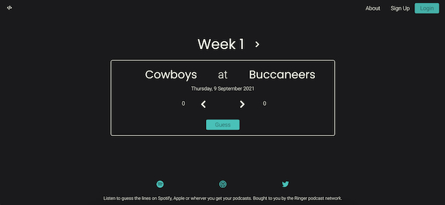

# Guess the Lines

  <kbd>
    
  </kbd>

## Description

A full stack application where users can sign up, login and out, and play a game where they compare their picks of a predicted winning margin of NFL games versus popular podcast host Bill Simmons and his weekly guest Cousin Sal. The aim is to be the one closest to the prediction made by betting site FanDuel. The winner is the one with the most picks closest to that of FanDuel.

I wanted to make a full stack application to put many of the areas I had been learning about to the test. This includes persistent user login, database structure, state management using Redux, and creating an API to relay with the database.

### Built with

- React
- Redux
- Node
- MongoDB
- Express

### Installation

npm install

cd client

npm install

### Legal disclaimer

Usage of this tool for attacking targets without prior mutual consent is illegal. It is the end user's responsibility to obey all applicable local, state, and federal laws. Developers assume no liability and are not responsible for any misuse or damage caused by this program.

### To-do

- [ ] Still need to do this
- [ ] ~~Decided not to do this~~
- [x] Done!

### License

This project is licensed under the [MIT License](LICENSE.md).
